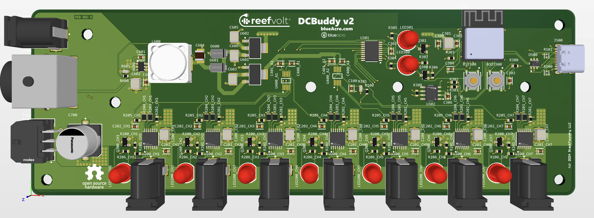

# blueAcro ReefVolt DCBuddy

> Tired of AC bricks? Try the DCBuddy!

Various DC power accessories for the aquarium market

## DCBuddy

An Open Hardware design for 12-36V aquarium accessories, featuring:

1. 7x, up to 5A, switched and current monitored power outlets with short circuit protection.
2. Works on an input range of 12-36V, up to 20A total current.
3. ESP32 on board, with USB-C port, for integration in Home Assistant.
4. Multiple input connectors including 2.1x5.5mm jack, DIN-4 jack, and Micro-Fit 3.0 jack with CAN bus support for power modules

### Design Thread

This project was started on Reef2Reef. See the thread:

https://www.reef2reef.com/threads/tired-of-ac-bricks-try-the-dcbuddy.1009642/
